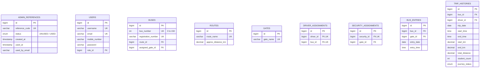

# 🚍 Smart College Transport Management System (Web + Mobile)

A commercial ERP-grade College Transport Management System built with **Spring Boot 3 (REST API + Spring Security + JWT)**, **React + Material-UI (Web ERP Portal)**, and **Flutter (Android/iOS Mobile)** backed by **MySQL**.

---

## 🌟 Key Architecture & Features

### 1. 🇮🇳 Multi-Language Support (Tamil & English)
- Seamless real-time switching between **English (🇬🇧)** and **தமிழ் (🇮🇳)** on both Web and Mobile.
- Language selection is automatically persisted in local storage and auto-loaded across sessions.
- 100% translated: navigation menus, dashboard KPI counters, forms, dialogs, validation messages, reports, and toasts.

### 2. 🔐 Protected Reference ID Admin Registration
- Public registration is strictly disabled.
- Only administrators with a valid, `UNUSED` Reference ID (`REF-ADM-xxxx`) can register.
- Once registered, the Reference ID status is permanently updated to `USED`.
- Driver and Security accounts are strictly created and provisioned by the Administrator.

### 3. 🛡️ Security Checkpoint Module
- Security logs in $\to$ Assigned Gate Name is automatically loaded.
- **Security staff personal name is hidden** for institutional privacy; only the Gate Name is displayed.
- **1-Click "BUS ENTER"**: Security selects Bus Number (0–150) and taps "Bus Enter". The system automatically captures Gate Name, Date, and Time.
- **Edit Restriction**: Security can edit the **Bus Number ONLY**; Date, Time, and Gate remain immutable.
- **Duplicate Prevention**: Rejects duplicate entries of the same bus on the same day with an instant localized alert.

### 4. 🚍 Driver Console Module
- Driver logs in $\to$ Assigned Bus & Route are automatically loaded.
- **Start KM Automation**:
  * Day 1: Driver manually enters initial Start KM.
  * Subsequent Days: Previous day's **End KM automatically becomes today's Start KM**.
- **College Arrival**: Driver enters Student Count and clicks "Save" (permanently recorded).
- **End Journey**: Driver enters End KM ($\ge \text{Start KM}$). System automatically computes $\text{Distance} = \text{End KM} - \text{Start KM}$, captures End Time, and completes the trip.

### 5. 👑 Administrator ERP Module
- **10 Real-Time KPIs**: Total Buses, Drivers, Security Staff, Routes, Gates, Active Buses, Today's Students, Today's Distance, Running Trips, Completed Trips, Pending Trips.
- **Telemetry Visualizations**: Bus-wise Distance, Route-wise Student Distribution, 7-Day Distance & Student Area Charts, Trip Status Distribution.
- **Real-Time Bus Inspector (0–150)**: Live lookup displaying Plate No, Route, Driver Name & Mobile (with click-to-call), Gate Entry Time, Start Time, End Time, Start KM, End KM, Total Distance, Student Count, and Status.
- **Master CRUD**: Complete management for Buses (0–150), Drivers, Security staff, Routes, Gates.
- **1-to-1 Assignments**: Driver $\leftrightarrow$ Bus assignment, Security $\leftrightarrow$ Gate assignment.
- **Reports & Telemetry Exports**: Filter daily, weekly, monthly reports and export to **PDF** (with official college banner header) and **Excel** (.xlsx).

### 6. 🕒 Automated 3-Month Database Retention Policy
- Automated background Spring Boot scheduler running every night at midnight (`@Scheduled(cron = "0 0 0 * * ?")`).
- Purges transient `bus_entries` and `trip_histories` records older than **90 days (3 months)** while preserving master data.
- System Maintenance tab with full audit logs and manual "Clean Up Now" execution trigger.

---

## 👥 Default Credentials

| Role | Username | Password | Notes / Assigned Unit |
|---|---|---|---|
| **Admin** | `admin` | `admin+svgi` | Transport Head • All Management Masters & Reports |
| **Admin** | `svgiadmin` | `admin+svgi` | System Admin Account |
| **Driver** | `DR25` (or `25`) | `25+svgi` | Driver • Assigned to Bus #25 (Erode Route) |
| **Driver** | `DR42` (or `42`) | `42+svgi` | Driver • Assigned to Bus #42 (Tiruppur Route) |
| **Security** | `north` | `north+svgi` | North Gate Checkpoint Terminal |
| **Security** | `south` | `south+svgi` | South Gate Checkpoint Terminal |
| **Security** | `main` | `main+svgi` | Main Gate Checkpoint Terminal |

### Valid Reference IDs for New Admin Registration:
- `REF-ADM-2026-001` (`UNUSED`)
- `REF-ADM-2026-002` (`UNUSED`)
- `REF-ADM-2026-003` (`UNUSED`)
- `REF-ADM-2026-004` (`UNUSED`)

---

## 🚀 Running the Project Locally

### Prerequisites
- **Java 17 or Java 21**
- **Node.js 18+ and npm**
- **Flutter SDK** (for mobile client)
- **MySQL 8.0+** (Optional: defaults to fast in-memory H2 with seed data for instant zero-setup execution)

---

### 1. Start Spring Boot Backend
```bash
cd backend
# For Windows
./mvnw spring-boot:run
# Or if Maven is installed:
mvn spring-boot:run
```
* Backend starts at: `http://localhost:8080`
* Swagger / OpenAPI Docs: `http://localhost:8080/swagger-ui.html`
* H2 Database Console: `http://localhost:8080/h2-console` (JDBC URL: `jdbc:h2:mem:college_transport`, User: `sa`, Password: empty)

To run with MySQL:
```bash
./mvnw spring-boot:run -Dspring-boot.run.profiles=mysql
```

---

### 2. Start React Web Portal
```bash
cd frontend
npm install
npm run dev
```
* Web Portal opens at: `http://localhost:5173`

---

### 3. Run Flutter Mobile App
```bash
cd mobile
flutter pub get
flutter run
```

---

## 🗄️ Database Structure



---

## 📄 API Reference Summary

- **Authentication**:
  * `GET /api/auth/validate-reference-id?code=REF-ADM-2026-001`
  * `POST /api/auth/register-admin`
  * `POST /api/auth/login`
- **Admin**:
  * `GET /api/admin/dashboard-stats`
  * `GET /api/admin/buses/search/{busNumber}` (0–150 lookup)
  * `GET/POST/PUT/DELETE /api/admin/buses`
  * `GET/POST/PUT/DELETE /api/admin/drivers`
  * `GET/POST/PUT/DELETE /api/admin/security`
  * `GET/POST/PUT/DELETE /api/admin/routes`
  * `GET/POST/PUT/DELETE /api/admin/gates`
  * `POST /api/admin/assignments/driver-bus`
  * `POST /api/admin/assignments/security-gate`
  * `GET/POST /api/admin/reference-ids`
- **Security Checkpoint**:
  * `GET /api/security/gate-info`
  * `POST /api/security/bus-entry`
  * `PUT /api/security/bus-entry/{id}` (Edit bus number only)
  * `GET /api/security/today-entries`
- **Driver Console**:
  * `GET /api/driver/bus-info`
  * `POST /api/driver/start-journey`
  * `POST /api/driver/save-students`
  * `POST /api/driver/end-journey`
  * `GET /api/driver/trip-history`
- **Reports & Maintenance**:
  * `POST /api/reports/query`
  * `POST /api/reports/export/excel`
  * `POST /api/maintenance/cleanup-now`
  * `GET /api/maintenance/cleanup-logs`
